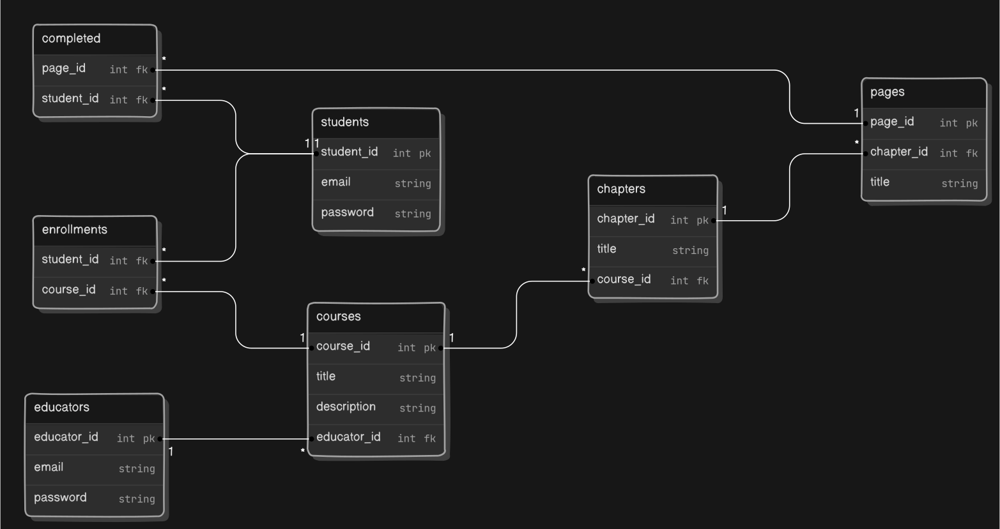
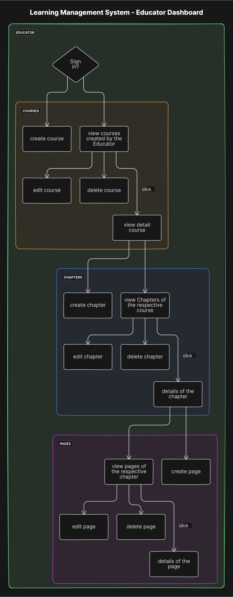
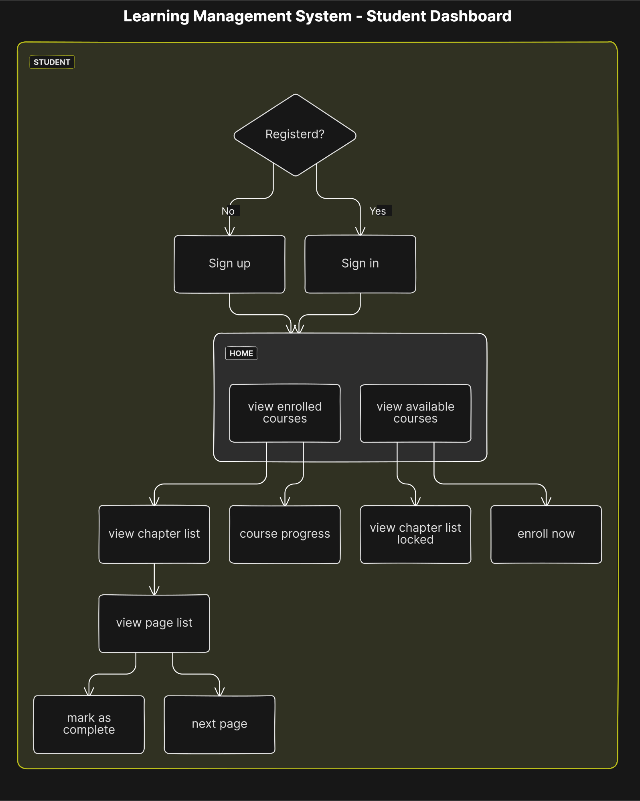

# Learning Management System

## Schema Model

## Flow diagram

### Educator Flow Diagram

### Student Flow Diagram

## Features

### authentication and authorisation

- [ ] sign in
- [ ] sign up

### Educator

- [ ] create course
- [ ] edit course
- [ ] delete course
- [ ] create chapter
- [ ] edit chapter
- [ ] delete chapter
- [ ] create page
- [ ] edit page
- [ ] delete page
- [ ] view reports

### Authorised everyone

- [ ] view courses
  - [ ] enrolled
  - [ ] available
- [ ] view chapters
  - [ ] locked
  - [ ] unlocked
- [ ] view pages
- [ ] mark as completed a page
- [ ] course progress
- [ ] enroll in a course
- [ ] change password

### Optional features

- [ ] search functionality
- [ ] quizzes at the end of the chapters
